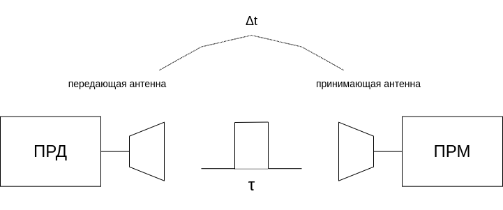
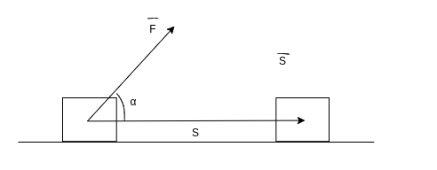
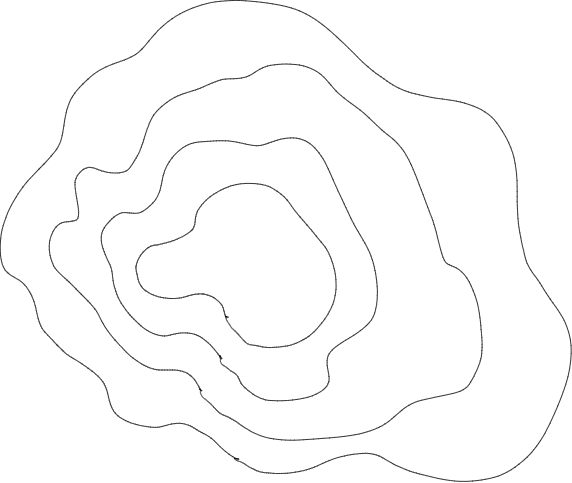
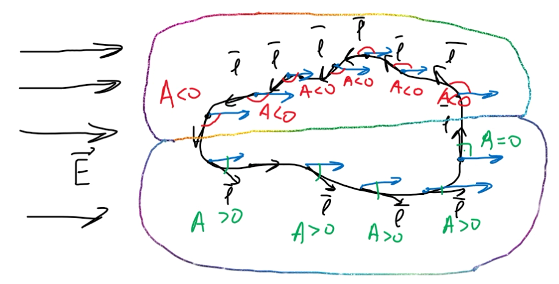

---
output:
  pdf_document:
    latex_engine: xelatex

title: Конспекты лекций по курсу "Электронные поля и волны"
author:

mainfont: DejaVuSerif.ttf
sansfont: DejaVuSans.ttf
monofont: DejaVuSansMono.ttf 
mathfont: texgyredejavu-math.otf

numbersections: true
indent: true

header-includes:
- \usepackage{indentfirst}
- \usepackage[russian]{babel}
---

(Электродинамика и распространение радиоволн)

\tableofcontents


# Литература.
1. [В.В. Никольский, Т.И. Никольская "Электродинамика и распространение радиоволн"](https://group8209.ru/Books/ED/ED_ed_raspr_voln.pdf)
1. [С.И. Баскаков "Электродинамика и распространение радиоволн"](https://studizba.com/pdf_reader/web/viewer.html?file=/uploads/unziped/real/213236/djvu/578-57397.pdf)


# Представление об электромагнитном поле.
Термин "**Поле**" употребляется, когда надо сопоставить каждой точке пространства некую физическую характеристику.

Примеры поля:

1. Поле высот
1. Поле температур
1. Поле скоростей

При этом определяются какие-то функции координат (и функции времени).
Электромагнитное поле будет характеризоваться распределением в пространстве некоторых
электромагнитных величин.



* $\Delta t$ --- длительность сигнала.
* $\tau$ --- длительность импульса.

Если $\Delta t >> \tau$, то в некоторое время мощность уже будет излучена передающей антеной, но еще не принята приемной.
Получается, что носителем энергии в этот промежуток времени выступает электромагнитное поле.


# Язык предмета.
Будем работать с векторами, векторными операциями итд -- это будет язык этого предмета.


# Векторы и действия над ними.
**Вектор** --- некий объект, который характеризуется числом и направлением в пространстве.

\begin{equation}
  \vec{A} = \vec{x_0}  A_x + \vec{y_0}  A_y + \vec{z_0} A_z
\end{equation}

* $\vec{x_0}, \vec{y_0}, \vec{z_0}$ --- единичные вектора.
* $A_x, A_y,  A_z$ --- Компоненты вектора.

## Сумма векторов.
\begin{equation}
  \vec{A} + \vec{B} = \vec{x_0}  (A_x + B_x) + \vec{y_0} (A_y + B_y) + \vec{z_0} (A_z + B_z)
\end{equation}

## Скалярное произведение.
\begin{equation}
  (\vec{A}, \vec{B}) = \vec{A} \vec{B} = A B cos(\alpha) = A_x B_x + A_y B_y + A_z B_z
\end{equation}



Скалярное произведение = длина первого вектора умножить на проекцию второго, на направление первого.

## Векторное произведение.
\begin{equation}
  |\vec{A}, \vec{B}| = \vec{A} \vec{B} = \vec{\nu_0} A B sin(\alpha) =
    \begin{pmatrix}
      \vec{x_0} & \vec{y_0} & \vec{z_0}\\
      A_x & A_y & A_z\\
      B_x & B_y & B_z
  \end{pmatrix}
\end{equation}

$\vec{\nu}$ --- орт направленный по нормали плоскости векторов A и B, причем так, что кратчайшее угловое растояние между их направлениями, обозначенное alpha, соответствует движению от $\vec{A}$ к $\vec{B}$ по часовой стрелке, если смотреть с $\nu_0$.

Справедливо равенство
\begin{equation}
  [\vec{B}, \vec{A}] = [\vec{A}, \vec{B}]
\end{equation}

Также, векторное произведение численно равно площади параллелограма.


# Обозначение единиц измерения электромагнитных величин.
В курсе будут встречаться разнообразные электромагнитные явления.
Будут использоваться следующие величины.

+:-----------------------------------+:-----------:+:----------:+
| Заряд                              |   $q$       |   [Кл]     |
+------------------------------------+-------------+------------+
| Ток                                |   $I$       |   [A]      |
+------------------------------------+-------------+------------+
| Плотность Заряда                   |   $\rho$    |   [Кл/м^3] |
+------------------------------------+-------------+------------+
| Плотность Тока                     |   $\vec{j}$ |   [A/м^3]  |
+------------------------------------+-------------+------------+
| Напряженность электрического тока  |   $\vec{E}$ |   [В/м]    |
+------------------------------------+-------------+------------+
| Напряженность магнитного поля      |   $\vec{H}$ |   [A/м]    |
+------------------------------------+-------------+------------+
| Электрическая индуктивность        |   $\vec{D}$ |   [Кл/м^2] |
+------------------------------------+-------------+------------+
| Магнитная индуктивность            |   $\vec{B}$ |   [Тл]     |
+------------------------------------+-------------+------------+


# Поля и операторы векторного анализа.
Поля могут быть скалярные или векторные (Определяются заданием в каждой точке рассматриваемой области пространства некоторой скалярной или векторной величины)

## Градиент.
Пусть в некоторой области пространства определено скалярное поле $\Psi(x,y,z)$.

Можем отображать поле линиями уравня, например.

Отобразим скалярное поле при помощи семейства поверхностей уровня.



\begin{equation}
  C_i = const
\end{equation}

\begin{equation}
  \Psi(x,y,z) = C_i
\end{equation}

**Градиент** -- это вектор, который направлен в сторону максимального возрастания Psi и равен скорости изменения Psi в этом направлении.

\begin{equation}
  grad(\Psi) = \vec{Nu_0} \frac{\delta\Psi}{\delta\nu}
\end{equation}

* $\nu$ --- линия ортогональная поверхности уровня.

* $\nu_0$ --- касательная к ней орта.

\begin{equation}
  grad _l (\Psi) = \vec{l_0} grad(\Psi) = \vec{l_0} \Nu_0 \frac{\delta\Psi}{\delta\nu} = 1\cdot1\cdot cos(\alpha) \cdot \frac{\delta\Psi}{\delta\nu}
\end{equation}


(max при $\alpha = 0$)

**Оператор градиента** делает из скалярного поля новое векторное поле.
\begin{equation}
  \vec{F} = grad(\Psi)
\end{equation}

Такое поле $\vec{F}$ называется потенциальным, а функция $\Psi$ называется потенциалом.

Поверхности уровня $\Psi=const$ -- Эквипотенциальная поверхность.

На всякий заряд, помещенный в электрическое поле действует электрическая сила.

При движении заряда в поле совершается работа.

Однако, если заряд описывает замкнутую кривую, то работа поля равна 0, каким бы ни было сложным поле, и по какой бы прихотливой кривой ни проходило движения заряда.

[Ландсберг --- учебник по Физике](http://mat.net.ua/mat/biblioteka-fizika/Landzberg-fizika-t1-mehanika-teplota.pdf)

```{python, echo=FALSE}
2+2
```
Пусть в некоторой области пространства создано электростатическое поле $E$.
В каждой точке поля действуют некоторые силы.



Введем положительное направление хода против часовой стрелки, и рассмотрим множество векторов $\vec{l}$.
Пусть в области находится положительный заряд. В каждой точке пространства сила будет действовать слева
направо.

Работа будет больше 0, если угол $\alpha$ будет больше 0 между $\vec{l}$ и $\vec{F}$

Когда заряд пройдет по замкнутому контуру --- полная работа электрических сил на этом пути: $A = \Sigma A_i = 0$.

Из этого делаем вывод, что электростатическое поле является **потенциальным**, а электростатические силы являются **консервативными**.

Свойства потенциального поля:

* $A = \oint \vec{E}q\delta\vec{l} = 0$
